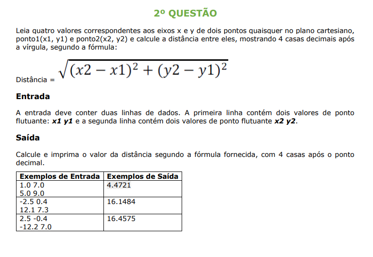

<h1>Dentro de cada pasta contém um README.md com instruções de instalação e execução</h1>

## Detalhes do desafio

	
	
	

<h4>Dúvidas entre em contato pelo <a href="https://www.linkedin.com/in/marco-antonio-monteiro-de-brito-541ba0144/" target="_blank">Linkedin</a> </h4>

<h4 align="center"> <em>&lt;/&gt;</em> by <a href="https://github.com/marcomonteirobrito" target="_blank">marcomonteirobrito</a> </h4>